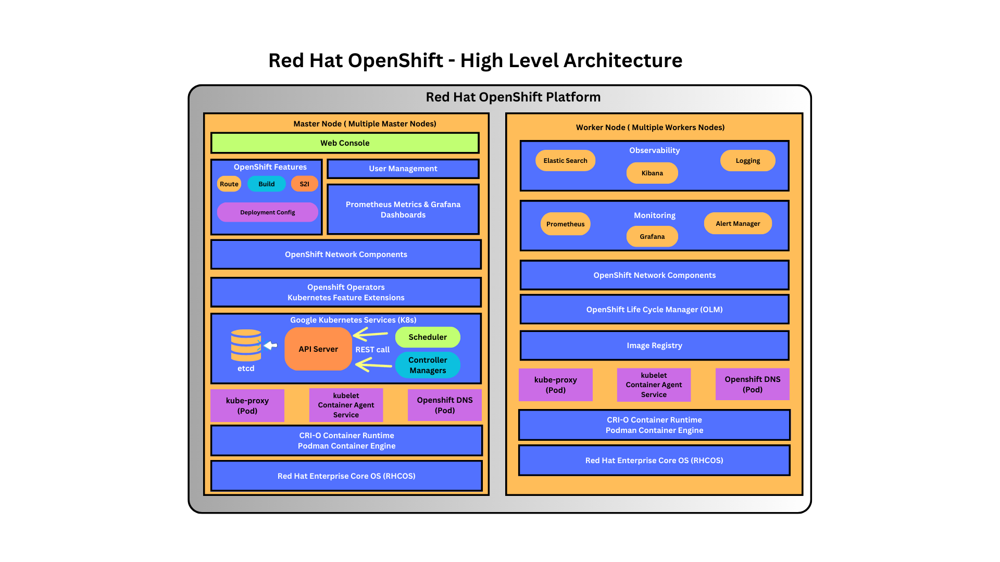
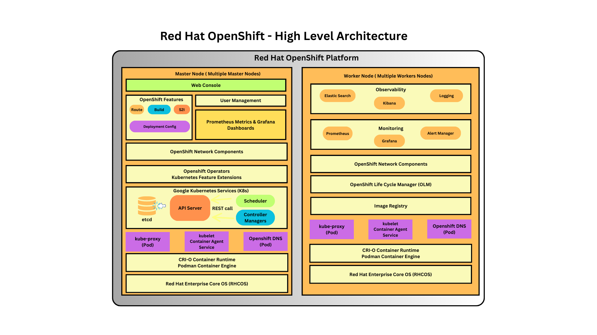

# Day 1

## What is dual-booting or multi-booting?
- Let's say we have a laption with Windows 10 pre-installed
- I need to do some prototype in Ubuntu
- You can use a system utlity called Boot Loaders like LILO, Grub 1, Grub2
- When we install boot loaders it gets installed in your hard disk Master Boot Record(MBR) - Sector 0, Byte 0 in your hard disk (512 bytes)
- When we boot our machine, BIOS POST (Power On Self Test), once the BIOS is loaded, BIOS will initialize all hardwares and then it then it instructs the CPU to load and run the Boot loader application from MBR
- The boot application starts scanning for Operating Systems installed on your Hard disk(s), if it finds more than one OS then it gives a menu for you to choose which OS you wish to boot into
- Only one OS can be active at any point of time

## Virtualization Overview
- aka Hypervisor
- hardware + software technology
- Processors
  - AMD ( Virtualization Feature is called AMD-V )
  - Intel ( Virtualization Feature is called VT-X )
  - Apple Silicon (ARM Processor)
- through virtualization we can run multiple operating systems side by side on the same laptop/desktop/workstation/server
- many OS can be active on the same machine 
- Virtualization can be enabled/disabed on the BIOS level too
- you can install Hypervisor
- Examples
  - Oracle VirtualBox ( Type 2 -Windows, Mac OS-X, Linux, Free )
  - VMWare
    - Workstation ( Type 2 - Windows & Linux, License )
    - Fusion ( Type 2 - Mac OS-X , License)
    - vSphere/vCenter ( Type 1 - Bare Metal Hypervisor, License )
  - Linux KVM (Typer 2 - Opensource & Free )
 
  - Type 1 Hypervisor
    - they are meant to be used in Workstations & Servers
    - they are called Bare Metal Hypervisor
    - They don't need a Host OS
      
  - Type 2 Hypervisors
    - they are installed on Laptops/Desktops/Workstation with some OS
    - they depend on Host OS ( Windows, Mac, Linux )

## Processor and Packaging
- Processor has one or more CPU Cores
- Processor are packaged in 2 forms
  - SCM - Single Chip Module
    - only one Processor will be in the IC
  - MCM - Multiple chip Module
    - 2/4/8 Processors can be package in a single IC
- Examples
  - One Processors supports - 128/256/512 CPU Cores
  - MCM IC - let's take that it has 4 Processors in a single IC
  - Let's assume, each Processor supports 128 CPU Cores
  - Generally Server motherboards comes with multiple Processor Sockets ( 2/4/8 Socket Motherboards )
  - Final assumption
    - a server motherboard that supports 4 Sockets
    - each Socket is installed with MCM with 4 Processors on each IC
    - Processor - 128 CPU Cores
    - Total CPU Core - 4 Sockets x 4 x 128 = 2048 CPU Cores
    - Total logical cores - 2048 x 2 = 4096 virtual cores in a single server
  - Hypertheading
    - each Physical CPU double as 2/4/8 logical/virtual CPU Cores
  - each Operating Systems runs in a separate Virtual Machine
  - Virtual Machines are also referred as Guest OS
  - each Virtual Machine represents one Operating System
  - Each Virtual Machines requires ( hence called heavy-weight virtualization )
    - dedicated hardware resources
      - CPU
      - RAM
      - Storage

## Containerization
- application virtualization technology
- each container represents one application process
- container is not an Operating Sytem
- container has one application and its dependent libraries
- normally application processor will not get an IP address
- but containers get an IP Address
- container has their own file system ( files & folders )
- container has their own network stack with software defined network card
- light-weight virtualization
  - reason being, containers shares the hardwares on the underlying host operating systems
  - containers also shares the host-os Kernel
  - containers doesn't have their own kernel

## Virtualization vs Containerization
- Each Virtual Machine represents an OS while each Container represents a single application
- Each Virtual Machines gets dedicated hardware resources while containers running on the same OS shares the hardware resources on the host OS
- Each OS running on the Virtual Machine has its own Kernel, while containers don't have their own kernel, containers depends on Host OS kernel

## Docker Overview

## Docker - High Level Architecture

## Red Hat OpenShift Overview

## Red Hat OpenShift - High-Level Architecture

## Docker SWARM vs Kubernetes vs OpenShift

## Commonly used - Kubernetes/Openshift Resources
