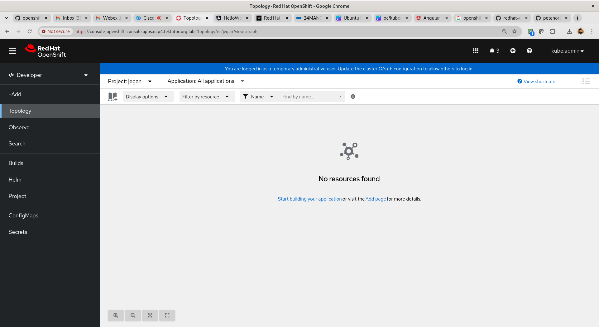
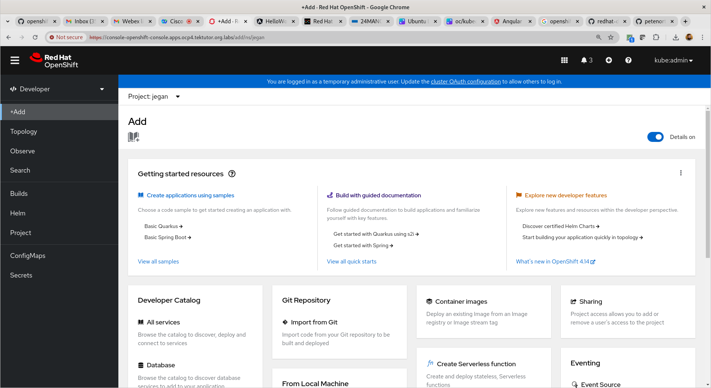
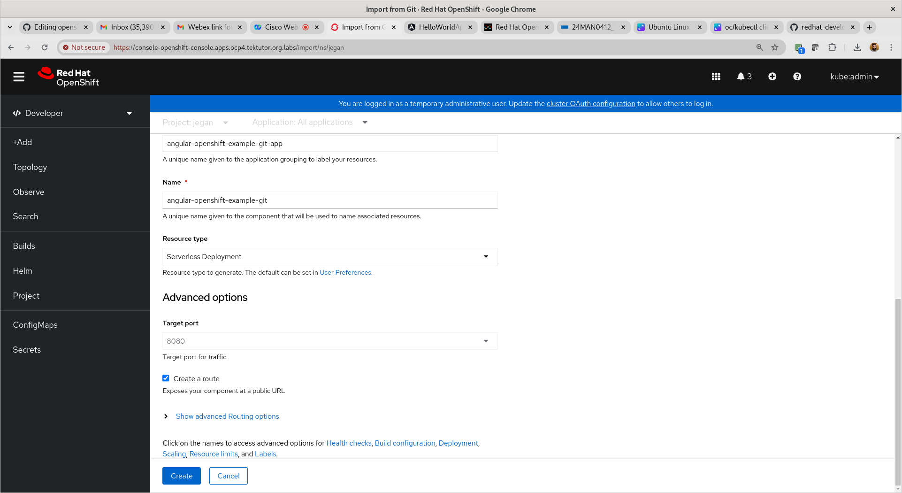
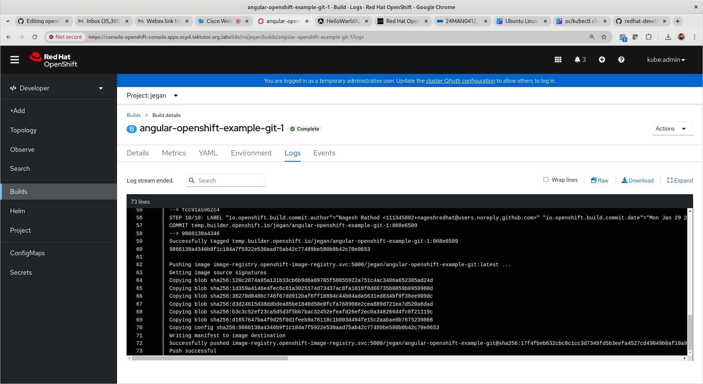

# Day 4

## References - You may find some interesting openshift examples here
<pre>
https://github.com/redhat-developer-demos  
</pre>

## Installing Helm package manager in Linux
```
curl -fsSL -o get_helm.sh https://raw.githubusercontent.com/helm/helm/main/scripts/get-helm-3
chmod 700 get_helm.sh
./get_helm.sh
```

## Helm Overview
- a package manager for Kubernetes and Openshift orchestration platforms
- using helm we can package our application as Charts
- our end-users will be able to use the charts we packaged to install into openshift
- helm tool is aware of Kubernetes and Openshift

## Lab - Creating a custom helm package for wordpress and mariadb multi-pod application
```
cd ~/openshift-may-2024
git pull
cd Day4/helm
helm create wordpress-chart
rm -rf wordpress-char/templates/*
#cp yaml-files/* wordpress-chart/templates
ls -l
helm package wordpress-chart
helm install wordpress wordpress-chart-0.1.0.tgz

helm list
```

You may verify if the wordpress and mysql is deployed properly.

## Lab - Deploying redis database with persistent volume
```
oc new-app --name=redis -e REDIS_PASSWORD=pass@123 bitnami/redis:latest --dry-run -o yaml
oc new-app --name=redis -e REDIS_PASSWORD=pass@123 bitnami/redis:latest --dry-run -o yaml > deploy-redis.yml

cd ~/openshift-may-2024
git pull
cd Day4/redis
oc apply -f redis-pv.yml
oc apply -f redis-pvc.yml
oc apply -f deploy-redis.yml
oc apply -f redis-route.yml

oc rsh deploy/redis

redis-cli -h localhost -p 6379 -a pass@123
set msg 'Hello Redis'
get msg
```

Expected output
<pre>
[jegan@tektutor.org redis]$ oc new-app --name=redis -e REDIS_PASSWORD=pass@123 bitnami/redis:latest --dry-run -o yaml
apiVersion: v1
items:
- apiVersion: image.openshift.io/v1
  kind: ImageStream
  metadata:
    annotations:
      openshift.io/generated-by: OpenShiftNewApp
    creationTimestamp: null
    labels:
      app: redis
      app.kubernetes.io/component: redis
      app.kubernetes.io/instance: redis
    name: redis
  spec:
    lookupPolicy:
      local: false
    tags:
    - annotations:
        openshift.io/imported-from: bitnami/redis:latest
      from:
        kind: DockerImage
        name: bitnami/redis:latest
      generation: null
      importPolicy:
        importMode: Legacy
      name: latest
      referencePolicy:
        type: ""
  status:
    dockerImageRepository: ""
- apiVersion: apps/v1
  kind: Deployment
  metadata:
    annotations:
      image.openshift.io/triggers: '[{"from":{"kind":"ImageStreamTag","name":"redis:latest"},"fieldPath":"spec.template.spec.containers[?(@.name==\"redis\")].image"}]'
      openshift.io/generated-by: OpenShiftNewApp
    creationTimestamp: null
    labels:
      app: redis
      app.kubernetes.io/component: redis
      app.kubernetes.io/instance: redis
    name: redis
  spec:
    replicas: 1
    selector:
      matchLabels:
        deployment: redis
    strategy: {}
    template:
      metadata:
        annotations:
          openshift.io/generated-by: OpenShiftNewApp
        creationTimestamp: null
        labels:
          deployment: redis
      spec:
        containers:
        - env:
          - name: REDIS_PASSWORD
            value: pass@123
          image: ' '
          name: redis
          ports:
          - containerPort: 6379
            protocol: TCP
          resources: {}
  status: {}
- apiVersion: v1
  kind: Service
  metadata:
    annotations:
      openshift.io/generated-by: OpenShiftNewApp
    creationTimestamp: null
    labels:
      app: redis
      app.kubernetes.io/component: redis
      app.kubernetes.io/instance: redis
    name: redis
  spec:
    ports:
    - name: 6379-tcp
      port: 6379
      protocol: TCP
      targetPort: 6379
    selector:
      deployment: redis
  status:
    loadBalancer: {}
kind: List
metadata: {}  

[jegan@tektutor.org redis]$ oc apply -f redis-pv.yml 
persistentvolume/redis-pv-jegan created
[jegan@tektutor.org redis]$ oc apply -f redis-pvc.yml 
persistentvolumeclaim/redis-pvc-jegan created
[jegan@tektutor.org redis]$ oc apply -f deploy-redis.yml 
imagestream.image.openshift.io/redis created
deployment.apps/redis created
service/redis created

[jegan@tektutor.org redis]$ oc get svc
NAME    TYPE        CLUSTER-IP      EXTERNAL-IP   PORT(S)    AGE
redis   ClusterIP   172.30.29.107   <none>        6379/TCP   20s
[jegan@tektutor.org redis]$ oc expose svc/redis --dry-run=client -o yaml 
apiVersion: route.openshift.io/v1
kind: Route
metadata:
  creationTimestamp: null
  labels:
    app: redis
    app.kubernetes.io/component: redis
    app.kubernetes.io/instance: redis
  name: redis
spec:
  port:
    targetPort: 6379-tcp
  to:
    kind: ""
    name: redis
    weight: null
status: {}
[jegan@tektutor.org redis]$ oc expose svc/redis --dry-run=client -o yaml > redis-route.yml
[jegan@tektutor.org redis]$ oc apply -f redis-route.yml 
route.route.openshift.io/redis created

jegan@tektutor.org redis]$ oc rsh deploy/redis
$ ls
bin  bitnami  boot  dev  entrypoint.sh	etc  home  lib	lib64  media  mnt  opt	proc  root  run  run.sh  sbin  srv  sys  tmp  usr  var

$ redis-cli -h localhost -p 6379 -a
Unrecognized option or bad number of args for: '-a'
$ redis-cli -h localhost -p 6379 -a pass@123
Warning: Using a password with '-a' or '-u' option on the command line interface may not be safe.
localhost:6379> set msg 'Hello Redis'
OK
localhost:6379> get msg
"Hello Redis"
localhost:6379> exit
$ exit
</pre>


## Lab - Deploying an Angularjs application into openshift

Navigate to Developer Context


Click on Add menu


Click on "Import From Git"


Type this as GitHub url 
<pre>
https://github.com/redhat-developer-demos/Angular-openshift-example.git
</pre>
Under "Resource Type" make sure you selected "Deployment".

Other options, you may Accept all defaults and scroll down to click the "Create" button.






