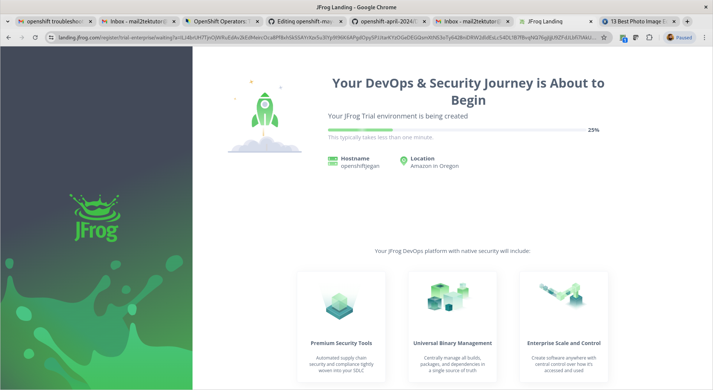
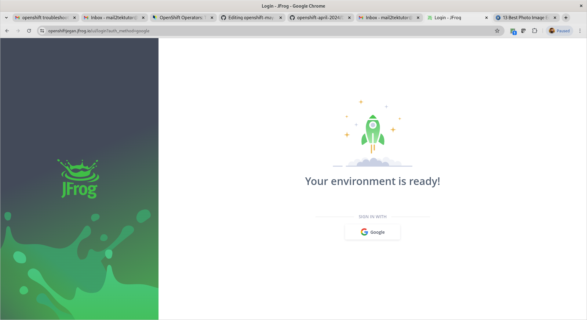

# Day 5

## Lab - Creating an Image Stream, build an image using BuildConfig and pushing the image to Image Stream
```
cd ~/openshift-may-2024
git pull
cd Day5/ImageStreamAndBuildConfig
oc project jegan
oc apply -f imagestream.yml
oc get imagestreams
oc get imagestream
oc get is

oc apply -f buildconfig.yml
oc get buildconfigs
oc get buildconfig
oc get bc

oc get builds
oc get builds

oc logs -f bc/spring-hello
```

Expected output
<pre>
 jegan@tektutor.org  ~/openshift-may-2024/Day5/ImageStreamAndBuildConfig   main  oc logs -f bc/spring-hello
Cloning "https://github.com/tektutor/openshift-may-2024.git" ...
	Commit:	40c7a55875d80bfe199a89551375889c02557828 (Updated buildconfig in Day5)
	Author:	Jeganathan Swaminathan <mail2jegan@gmail.com>
	Date:	Tue May 21 11:06:46 2024 +0530
time="2024-05-21T05:37:10Z" level=info msg="Not using native diff for overlay, this may cause degraded performance for building images: kernel has CONFIG_OVERLAY_FS_REDIRECT_DIR enabled"
I0521 05:37:10.447629       1 defaults.go:112] Defaulting to storage driver "overlay" with options [mountopt=metacopy=on].
Caching blobs under "/var/cache/blobs".

Pulling image registry.redhat.io/ubi8/openjdk-11:latest ...
Trying to pull registry.redhat.io/ubi8/openjdk-11:latest...
Getting image source signatures
Copying blob sha256:ca19c1d8b6a56d82b4d9cc9ee30899ce07641f8ba17831ffd074240384f32cb0
Copying blob sha256:50973ec5afdbaf48c719a37a132e9a827da1ad121015a22a9420e05800137a28
Copying config sha256:41ecfe9aa068500e58d86438b8a33611d16688a4dd388f5de8c43f4f728ee77c
Writing manifest to image destination
Adding transient rw bind mount for /run/secrets/rhsm
[1/2] STEP 1/6: FROM registry.redhat.io/ubi8/openjdk-11:latest AS builder
[1/2] STEP 2/6: MAINTAINER Jeganathan Swaminathan <jegan@tektutor.org>
--> da1a6a8c047b
[1/2] STEP 3/6: RUN mkdir -p -m 0700 ./hello/target
--> d0a2318330b0
[1/2] STEP 4/6: WORKDIR ./hello
--> 130104147115
[1/2] STEP 5/6: COPY . ./
--> 4bd2f8044bea
[1/2] STEP 6/6: RUN mvn package && cp ./target/spring-hello-1.0.jar /tmp/app.jar

[INFO] Replacing main artifact with repackaged archive
[INFO] ------------------------------------------------------------------------
[INFO] BUILD SUCCESS
[INFO] ------------------------------------------------------------------------
[INFO] Total time:  07:07 min
[INFO] Finished at: 2024-05-21T05:44:32Z
[INFO] ------------------------------------------------------------------------
--> 1aa7d4ba284e
[2/2] STEP 1/5: FROM registry.redhat.io/ubi8/openjdk-11:latest AS runner
[2/2] STEP 2/5: COPY --from=builder /tmp/app.jar .
--> d2c7c775b060
[2/2] STEP 3/5: CMD ["java","-jar","./app.jar"]
--> a49ccf6e5faf
[2/2] STEP 4/5: ENV "OPENSHIFT_BUILD_NAME"="spring-hello-1" "OPENSHIFT_BUILD_NAMESPACE"="jegan" "OPENSHIFT_BUILD_SOURCE"="https://github.com/tektutor/openshift-may-2024.git" "OPENSHIFT_BUILD_COMMIT"="40c7a55875d80bfe199a89551375889c02557828"
--> 837f9a2af512
[2/2] STEP 5/5: LABEL "io.openshift.build.commit.author"="Jeganathan Swaminathan <mail2jegan@gmail.com>" "io.openshift.build.commit.date"="Tue May 21 11:06:46 2024 +0530" "io.openshift.build.commit.id"="40c7a55875d80bfe199a89551375889c02557828" "io.openshift.build.commit.message"="Updated buildconfig in Day5" "io.openshift.build.commit.ref"="main" "io.openshift.build.name"="spring-hello-1" "io.openshift.build.namespace"="jegan" "io.openshift.build.source-context-dir"="Day5/ImageStreamAndBuildConfig" "io.openshift.build.source-location"="https://github.com/tektutor/openshift-may-2024.git"
[2/2] COMMIT temp.builder.openshift.io/jegan/spring-hello-1:c5e02ad5
--> c276403a7bf3
Successfully tagged temp.builder.openshift.io/jegan/spring-hello-1:c5e02ad5
c276403a7bf315f9ec2d53ad62832fd02f23ce1d6e94c60192d0846db9c7896a

Pushing image image-registry.openshift-image-registry.svc:5000/jegan/tektutor-spring-hello:latest ...
Getting image source signatures
Copying blob sha256:38c8b7d0b2e0247230e14bb40c3206b5538425b2762e896203ca09ff340f3d68
Copying blob sha256:50973ec5afdbaf48c719a37a132e9a827da1ad121015a22a9420e05800137a28
Copying blob sha256:ca19c1d8b6a56d82b4d9cc9ee30899ce07641f8ba17831ffd074240384f32cb0
Copying config sha256:c276403a7bf315f9ec2d53ad62832fd02f23ce1d6e94c60192d0846db9c7896a
Writing manifest to image destination
Successfully pushed image-registry.openshift-image-registry.svc:5000/jegan/tektutor-spring-hello@sha256:e3e8c5c3e7abf8c0e740a730121ca6c021f93fce0d3559967b16b0e429103e7f
Push successful  
</pre>

Let's deploy the application into openshift
```
cd ~/openshift-may-2024
git pull
cd Day5/ImageStreamAndBuildConfig
oc project jegan

oc apply -f hello-deploy.yml
oc apply -f hello-svc.yml
oc apply -f hello-route.yml

oc get deploy,svc,route

curl http://hello-jegan.apps.ocp4.tektutor.org.labs
```

## CI/CD

You need to create a trial JFrog Artifactory (14-days Cloud Trial) @ https://jfrog.com/start-free/#trialOptions with your personal gmail account (No credit cards required)


You could choose AWS ( they use their cloud account hence no charges are applicable to us - I didn't give my mobile number )





Now you should be able to login to your jfrog cloud with your gmail account that your registered with JFrog trial


## What does Serverless mean?
- serverless does not mean the absence of servers
- is an architecture model for running applications in an environment that is abstracted away from the developers
- developers can focus more on developing their applications than where their code runs
- in other deployment models, resources waits idle to serve requests and run regardless of whether there is work to do
- an ideal serverless workload executes a single task
- a function that retrieves data from a database can be an excellent serverless workload
- the database server is not a good serverless workload because it needs to run continuously
- serverless model is the idea of the cold start
- when using serverless, there is a period between the request and creating the pod environment. This period is the cold start.

- Examples
  - OpenShift Serverless workloads follow this workflow:
    - A request comes in
    - A pod is spun up to service the request
    - The pod services the request
    - The pod is destroyed

  - Another example of a serverless workload can be an image processing function
     - An event could be a photo upload. The uploaded photo triggers an event to run an application to process the image.
     - For example, the application may overlay text, create a banner, or make a thumbnail.
     - Once the image is stored permanently, the application has served its purpose and is no longer needed.

## Serverless Features
- Stateless Function
  - a function to query a database and return the data
  - a function to query weather report and return the data
  
- Event Driven
  - serverless model relies on a trigger to execute the code
  - could be a request to an API or an event on a queue
  
- Auto Scales to Zero
  - Being able to scale to zero means your code only runs when it needs to respond to an event.
  - Once the request is served, resources are released.

## Benefits of Serverless
- cost savings and more efficient utilization of CPU, RAM, and storage resources (better hardware utilizaton in general)
- Code is executed as needed, there is no idle time. We only pay for the execution time.
- As there is no servers to manage, no need to worry about Infrastructure management activities like
  - security updates
  - montoring
  - hardware maintenance
  - hardware upgradation, etc.,
- Scaling is easier on demand
- high availability (HA)
  
## Knative and Red Hat Serverless 

- Red Hat Serverless is based on Knative project
- Knative provides a serverless application layer on top of OpenShift/Kubernetes
- Knative consists of 3 building blocks
  1. Build
  2. Eventing
  3. Serving
