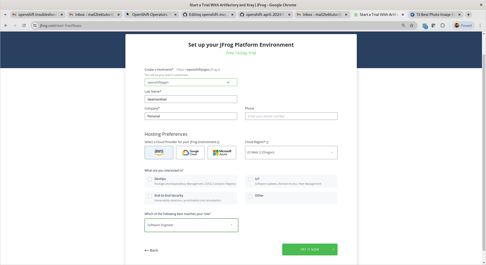

# Day 5

## CI/CD

You need to create a trial JFrog Artifactory (14-days Cloud Trial) @ https://jfrog.com/start-free/#trialOptions with your personal gmail account (No credit cards required)

You could choose AWS ( they use their cloud account hence no charges are applicable to us - I didn't give my mobile number )

## What does Serverless mean?
- serverless does not mean the absence of servers
- is an architecture model for running applications in an environment that is abstracted away from the developers
- developers can focus more on developing their applications than where their code runs
- in other deployment models, resources waits idle to serve requests and run regardless of whether there is work to do
- an ideal serverless workload executes a single task
- a function that retrieves data from a database can be an excellent serverless workload
- the database server is not a good serverless workload because it needs to run continuously
- serverless model is the idea of the cold start
- when using serverless, there is a period between the request and creating the pod environment. This period is the cold start.

- Examples
  - OpenShift Serverless workloads follow this workflow:
    - A request comes in
    - A pod is spun up to service the request
    - The pod services the request
    - The pod is destroyed

  - Another example of a serverless workload can be an image processing function
     - An event could be a photo upload. The uploaded photo triggers an event to run an application to process the image.
     - For example, the application may overlay text, create a banner, or make a thumbnail.
     - Once the image is stored permanently, the application has served its purpose and is no longer needed.

## Serverless Features
- Stateless Function
  - a function to query a database and return the data
  - a function to query weather report and return the data
  
- Event Driven
  - serverless model relies on a trigger to execute the code
  - could be a request to an API or an event on a queue
  
- Auto Scales to Zero
  - Being able to scale to zero means your code only runs when it needs to respond to an event.
  - Once the request is served, resources are released.

## Benefits of Serverless
- cost savings and more efficient utilization of CPU, RAM, and storage resources (better hardware utilizaton in general)
- Code is executed as needed, there is no idle time. We only pay for the execution time.
- As there is no servers to manage, no need to worry about Infrastructure management activities like
  - security updates
  - montoring
  - hardware maintenance
  - hardware upgradation, etc.,
- Scaling is easier on demand
- high availability (HA)
  
## Knative and Red Hat Serverless 

- Red Hat Serverless is based on Knative project
- Knative provides a serverless application layer on top of OpenShift/Kubernetes
- Knative consists of 3 building blocks
  1. Build
  2. Eventing
  3. Serving
